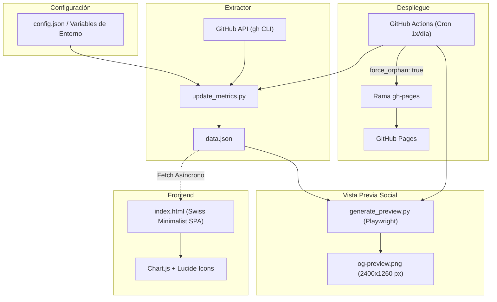

<div align="center">

# GitHub Telemetry & Stats Dashboard

[](https://opensource.org/licenses/MIT)
[](https://www.python.org/)
[](https://www.chartjs.org/)
[](https://playwright.dev/)
[](https://github.com/features/actions)

<br />

> **Dashboard estático, reactivo y de alta fidelidad para monitorear huella digital, actividad, métricas de adopción y colaboradores de cualquier cuenta u organización de GitHub.**

</div>

---

## ⚡ Guía de Replicación Rápida (Zero-Config)

### 1. Crear Fork del Repositorio
Hacer click en el botón **Fork** en la cabecera de esta página para generar tu propia copia en GitHub.

---

### 2. Definir Configuración en `config.json`
Solo necesitas especificar el usuario u organización objetivo en [`config.json`](file:///config.json):

```json
{
  "target": "TU_USUARIO_O_TU_ORGANIZACION"
}
```

> [!NOTE]
> Todo lo demás es **100% automático**:
> - Auto-detección de usuario vs organización (`User` / `Organization`).
> - Filtro automático de repositorios originales (descarta forks de terceros con `--source`).
> - Cálculo dinámico de trayectoria y antigüedad a partir del repositorio más antiguo.
> - Auto-generación de tarjetas sociales OpenGraph / Twitter en resolución Retina 2x (`og-preview.png`).

---

### 3. Configurar GitHub Pages
1. Ir a **Settings** > **Pages** en el repositorio.
2. En **Build and deployment** > **Source**, seleccionar **Deploy from a branch**.
3. En **Branch**, seleccionar la rama **`gh-pages`** y directorio `/(root)`.
4. Guardar los cambios.

---

### 4. Ejecutar la Sincronización

#### Automatizado (GitHub Actions)
1. Ir a la pestaña **Actions** en el repositorio.
2. Seleccionar el workflow **`Auto-Sync Telemetry & Deploy to GitHub Pages`**.
3. Hacer click en **Run workflow**.
4. El pipeline extraerá los datos, compilará `data.json`, generará `og-preview.png` y desplegará a `gh-pages`. El cron continuará ejecutándose automáticamente **1 vez al día (06:00 UTC)**.

#### Localmente
```bash
# 1. Autenticación en GitHub CLI (solo una vez)
gh auth login

# 2. Desarrollo con Makefile (extrae telemetría y levanta http://localhost:8000)
make dev

# 3. Generar tarjeta para redes sociales en alta resolución
make preview
```

---

## 🏗️ Arquitectura de Datos y Flujo de Trabajo



---

## 📁 Estructura del Directorio

```text
├── .github/
│   └── workflows/
│       └── sync_metrics.yml   # Automatización CI/CD y despliegue a gh-pages
├── config.json                # Configuración declarativa mínima (target)
├── update_metrics.py          # Extractor de datos puro (Single Responsibility Principle)
├── generate_preview.py        # Motor de renderizado OpenGraph con Playwright
├── share.html                 # Plantilla base para exportación de preview social
├── index.html                 # Interfaz visual reactiva suiza (Full-width, sortable)
├── og-preview.png             # Vista previa generada para redes sociales (2400x1260 px)
├── Makefile                   # Comandos rápidos de desarrollo y automatización
├── VERSION                    # Single source of truth de versión (SemVer)
├── CHANGELOG.md               # Registro histórico de versiones
└── README.md                  # Documentación técnica
```

---

## 🛠️ Stack Tecnológico

- **Frontend**: HTML5 Semántico, Vanilla CSS (Swiss Minimalist Design System), JavaScript Moderno asíncrono.
- **Gráficos & Componentes**: Chart.js (Radar de Ecosistema multieje) y Lucide Icons.
- **Backend / Extractor**: Python 3.10+ (`dataclasses`, `pathlib`, `logging`, `subprocess`).
- **Renderizado Social**: Playwright / Headless Chromium para exportación Retina 2x de `og-preview.png`.
- **Infraestructura**: GitHub CLI, GitHub Actions y GitHub Pages (rama aislada `gh-pages`).

---

## 📜 Licencia

Distribuido bajo la licencia **MIT**. Consulta el archivo `LICENSE` para más información.
