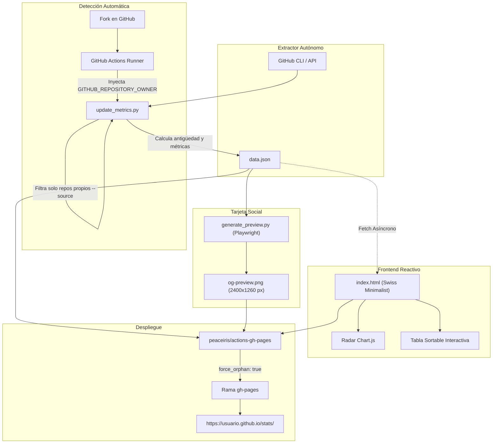

<div align="center">

# GitHub Telemetry & Stats Dashboard

[](https://opensource.org/licenses/MIT)
[](https://www.python.org/)
[](https://www.chartjs.org/)
[](https://playwright.dev/)
[](https://github.com/features/actions)

<br />

> **Dashboard estático, reactivo y de alta fidelidad para monitorear huella digital, actividad, métricas de adopción y colaboradores de cualquier cuenta u organización de GitHub.**
>
> *Desarrollado con el diseño e ingeniería del ecosistema open source de **[Shellaquiles](https://shellaquiles.org)**.*

</div>

---

## 🎯 ¿Qué es y para qué sirve?

**GitHub Telemetry & Stats Dashboard** es el motor de **observabilidad y analítica open source** diseñado por **[Shellaquiles](https://shellaquiles.org)** para medir, visualizar y compartir la **Huella Digital** y el rendimiento técnico de cualquier usuario u organización en GitHub.

A diferencia del perfil tradicional de GitHub, este sistema compila toda la actividad de tus proyectos fuente en un dashboard unificado bajo el **Swiss Minimalist System**:

### 🔍 Secciones y Capacidades del Sistema

- **Huella Digital (Org Hero & Radar de Ecosistema):** Muestra el balance acumulado de todos los repositorios públicos en un gráfico de radar multieje (`Chart.js`) y 4 KPIs globales: *Stars*, *Forks*, *Commits* y *Clones*.
- **Stats Globales (Tabla Técnica Sortable):** Matriz interactiva de proyectos con ordenamiento de columnas en tiempo real por nombre, stack, fecha de creación (`Creado`), stars, forks, clones, visitas, commits, releases, pull requests y licencia.
- **Por Repositorio (Catálogo de Proyectos):** Cuadrícula de tarjetas individuales por proyecto con métricas clave, etiquetas de lenguaje, versión de releases y enlaces directos a GitHub y Demo.
- **Colaboradores y Core Team:** Cuadro de honor dinámico que mapea a la comunidad y equipo que contribuye con código, registrando commits totales y repositorios con actividad (excluyendo cuentas bots automáticamente).
- **Captura Social Automática (OpenGraph):** Renderiza en cada sincronización una tarjeta social de alta fidelidad (`og-preview.png` en resolución Retina 2x de `2400 × 1260 px`) mediante Playwright headless, lista para Twitter/X y LinkedIn.
- **Operación Zero-Config & Costo $0:** Se ejecuta de forma automatizada mediante **GitHub Actions** (cron diario) y se publica en **GitHub Pages** sin requerir servidores ni bases de datos.

---

## ⚡ Guía Paso a Paso para Replicar (Zero-Config)

No necesitas tocar una sola línea de código ni editar archivos de configuración. El sistema detecta automáticamente tu usuario de GitHub al hacer Fork.

### 📌 Paso 1: Hacer Fork del Repositorio
1. En la parte superior derecha de esta página, haz clic en el botón **Fork**.
2. Selecciona tu cuenta personal o tu organización como destino.
3. Haz clic en **Create fork**.

---

### 📌 Paso 2: Habilitar GitHub Pages

Para publicar tu dashboard en la web pública necesitas activar GitHub Pages. Puedes consultar la [documentación oficial de GitHub Pages](https://docs.github.com/es/pages/getting-started-with-github-pages/configuring-a-publishing-source-for-your-github-pages-site) para más detalles.

1. En tu nuevo repositorio bifurcado, ve a la pestaña **Settings** (Configuración).
2. En la barra lateral izquierda, selecciona la sección **Pages** (o accede directamente a `https://github.com/<TU-USUARIO>/stats/settings/pages`).
3. En la sección **Build and deployment**:
   - **Source:** Selecciona `Deploy from a branch`.
   - **Branch:** Selecciona la rama **`gh-pages`** y la carpeta `/(root)`.
4. Haz clic en el botón **Save** (Guardar).

> [!NOTE]
> - **Requisitos:** El repositorio debe ser **Público** (o contar con GitHub Pro/Team/Enterprise si es privado).
> - Si la rama `gh-pages` aún no aparece en la lista desplegable, se creará de forma automática tras ejecutar la primera sincronización en el **Paso 3**; regresa a este menú a seleccionarla una vez terminado el workflow.
> - **Permisos de Actions:** Asegúrate de que en **Settings** > **Actions** > **General** > *Workflow permissions* esté marcada la opción **"Read and write permissions"** (activa por defecto en GitHub).

---

### 📌 Paso 3: Ejecutar la Sincronización Inicial
1. En tu repositorio, haz clic en la pestaña **Actions**.
2. Si los workflows están pausados por defecto al hacer fork, haz clic en el botón verde **"I understand my workflows, go ahead and enable them"**.
3. En el menú de la izquierda, selecciona el workflow **`Auto-Sync Telemetry & Deploy to GitHub Pages`**.
4. Haz clic en el botón **Run workflow** (a la derecha) y presiona el botón verde **Run workflow**.

---

### 🎉 ¡Listo! Tu Dashboard está en Vivo
Una vez que el workflow termine en GitHub Actions (~1 minuto):
- Tu telemetría estará publicada automáticamente en:
  ```text
  https://<TU-USUARIO>.github.io/stats/
  ```
- **Actualizaciones Automáticas:** El pipeline de GitHub Actions se ejecutará **1 vez al día (06:00 UTC)** de forma desatendida para mantener tus métricas siempre al día.
- **Vista Previa Social Automática:** Se generará una imagen de previsualización Retina 2x (`og-preview.png`) lista para compartir en Twitter/X, LinkedIn y Discord.

---

## 💻 Desarrollo y Pruebas Locales (Opcional)

Si deseas probar o personalizar el dashboard en tu computadora local:

```bash
# 1. Clonar tu repositorio bifurcado
git clone https://github.com/<TU-USUARIO>/stats.git
cd stats

# 2. Iniciar extractor y servidor local (levanta http://localhost:8000)
make dev

# 3. Generar la tarjeta para redes sociales en alta resolución
make preview
```

> [!TIP]
> **Personalización avanzada opcional**: Si en algún momento deseas auditar una organización o usuario diferente al dueño del repositorio, puedes crear un archivo `config.json` con `{"target": "otro-usuario"}`. Si el archivo no existe o está vacío, el sistema siempre auditará al dueño del repositorio de forma automática.

---

## 🏗️ Arquitectura de Datos y Flujo de Trabajo



---

## 📁 Estructura del Directorio

```text
├── .github/
│   └── workflows/
│       └── sync_metrics.yml   # Workflow CI/CD y despliegue a gh-pages
├── config.json                # Configuración opcional (Zero-Config por defecto)
├── update_metrics.py          # Extractor puro y auto-resolución de usuario
├── generate_preview.py        # Motor de renderizado OpenGraph con Playwright
├── share.html                 # Plantilla base para exportación de preview social
├── index.html                 # Interfaz visual reactiva suiza (Full-width, sortable)
├── og-preview.png             # Vista previa generada para redes sociales (2400x1260 px)
├── Makefile                   # Comandos rápidos de desarrollo y automatización
├── VERSION                    # Single source of truth de versión (SemVer)
├── CHANGELOG.md               # Registro histórico de versiones
└── README.md                  # Documentación técnica y guía paso a paso
```

---

## 🛠️ Stack Tecnológico

- **Frontend**: HTML5 Semántico, Vanilla CSS (Swiss Minimalist Design System), JavaScript Moderno asíncrono.
- **Gráficos & Componentes**: Chart.js (Radar de Ecosistema multieje) y Lucide Icons.
- **Backend / Extractor**: Python 3.10+ (`dataclasses`, `pathlib`, `logging`, `subprocess`).
- **Renderizado Social**: Playwright / Headless Chromium para exportación Retina 2x de `og-preview.png`.
- **Infraestructura**: GitHub CLI, GitHub Actions y GitHub Pages (rama aislada `gh-pages`).

---

## 🐢 Impulsado por Shellaquiles

Este dashboard es parte del ecosistema de herramientas abiertas de **[Shellaquiles](https://shellaquiles.org)** — una comunidad e iniciativa dedicada a crear utilidades de terminal, motores de automatización, analítica de datos y herramientas de desarrollo para la comunidad open source.

¿Te apasiona el software libre, la automatización y crear herramientas útiles para desarrolladores?
- 🌐 **Sitio Oficial:** [shellaquiles.org](https://shellaquiles.org)
- 🐙 **GitHub:** [github.com/shellaquiles](https://github.com/shellaquiles)
- 🤝 **¡Súmate a la comunidad!** Explora nuestros proyectos (`cron-quiles`, `pandocquiles`, `tribuTACOS`, `KARNITAS`, `stats`) y colabora en el ecosistema.

---

## 📜 Licencia

Distribuido bajo la licencia **MIT**. Desarrollado e impulsado por **Shellaquiles**. Consulta el archivo `LICENSE` para más información.
