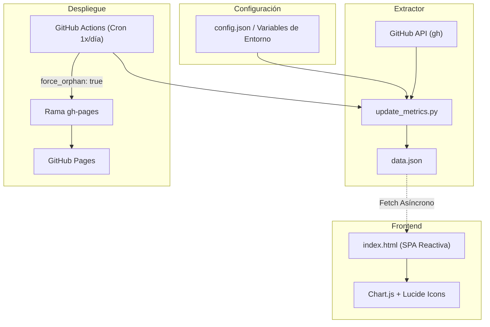

<div align="center">

# GitHub Telemetry & Stats Dashboard

[](https://opensource.org/licenses/MIT)
[](https://www.python.org/)
[](https://tailwindcss.com/)
[](https://www.chartjs.org/)
[](https://github.com/features/actions)

<br />

> **Dashboard estático y reactivo para monitorear telemetría, tráfico y colaboradores de cualquier cuenta u organización de GitHub.**

</div>

---

## Guía de Replicación

### 1. Crear Fork del Repositorio
Hacer click en el botón **Fork** en la cabecera de esta página para generar tu propia copia en GitHub.

---

### 2. Definir Configuración en `config.json`
Actualizar [`config.json`](file:///config.json) con los parámetros del usuario u organización objetivo:

```json
{
  "target": "TU_USUARIO_O_TU_ORGANIZACION",
  "is_org": false,
  "title": "stats — Telemetría Open Source",
  "brand": {
    "prefix": "mi",
    "middle": "perfil",
    "suffix": ".dev",
    "prefix_color": "#22c55e",
    "suffix_color": "#f43f5e"
  },
  "links": {
    "github": "https://github.com/TU_USUARIO",
    "website": "https://miweb.com"
  },
  "exclude_repos": ["stats"]
}
```

> [!TIP]
> **Configuración mediante Variables de Entorno**: También puedes definir los parámetros sin tocar archivos mediante las *Secrets / Variables* de GitHub Actions: `STATS_TARGET`, `STATS_IS_ORG`, etc. Ver [`.env.example`](file:///.env.example).

---

### 3. Configurar GitHub Pages
1. Ir a **Settings** > **Pages** en el repositorio.
2. En **Build and deployment** > **Source**, seleccionar **Deploy from a branch**.
3. En **Branch**, seleccionar la rama **`gh-pages`** y directorio `/(root)`.
4. Guardar los cambios.

> [!NOTE]
> Si la rama `gh-pages` aún no aparece en la lista desplegable, se creará automáticamente tras ejecutar la primera sincronización (Paso 4).

---

### 4. Ejecutar la Sincronización

#### Automatizado (GitHub Actions)
1. Ir a la pestaña **Actions** en el repositorio.
2. Seleccionar el workflow **`Auto-Sync Telemetry & Deploy to GitHub Pages`**.
3. Hacer click en **Run workflow**.
4. El pipeline extraerá los datos, compilará `data.json` y desplegará a `gh-pages`. El cron continuará ejecutándose automáticamente **1 vez al día (06:00 UTC)**.

#### Localmente
```bash
# 1. Autenticación en GitHub CLI (solo una vez)
gh auth login

# 2. Desarrollo con Makefile (extrae telemetría y levanta http://localhost:8000)
make dev

# O ejecutando los comandos por separado:
python3 update_metrics.py
python3 -m http.server 8000
```

---

## Arquitectura de Datos y Flujo de Trabajo



---

## Estructura del Directorio

```text
├── .github/
│   └── workflows/
│       └── sync_metrics.yml   # Automatización CI/CD y despliegue a gh-pages
├── config.json                # Configuración declarativa
├── .env.example               # Plantilla de variables de entorno
├── update_metrics.py          # Extractor de datos (Single Responsibility Principle)
├── index.html                 # Interfaz visual reactiva (Swiss Minimalist)
├── Makefile                   # Comandos rápidos de desarrollo local
├── CHANGELOG.md               # Registro histórico de versiones
└── README.md                  # Documentación técnica
```

---

## Stack Tecnológico

- **Frontend**: HTML5 Semántico, JavaScript Moderno (ESModules / Async Fetch).
- **Estilos**: Tailwind CSS, tipografías Inter y JetBrains Mono.
- **Gráficos**: Chart.js y Lucide Icons.
- **Backend / Extractor**: Python 3.10+ (`dataclasses`, `pathlib`, `logging`, `subprocess`).
- **Infraestructura**: GitHub CLI, GitHub Actions y GitHub Pages.

---

## Registro de Cambios

Consulta el archivo [`CHANGELOG.md`](file:///CHANGELOG.md) para ver el historial detallado de cambios y versiones del proyecto.

---

## Licencia

Distribuido bajo la licencia [MIT](https://opensource.org/licenses/MIT).
